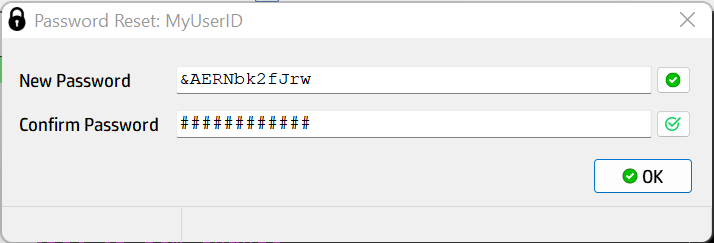
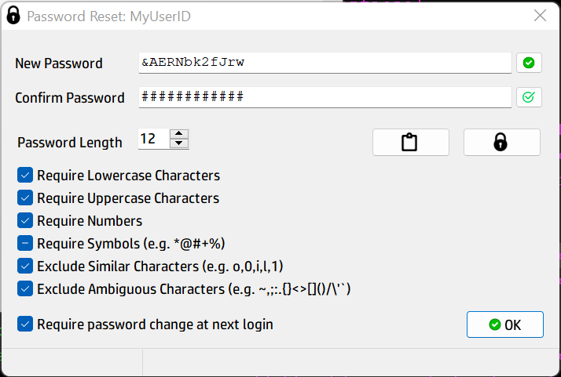

# PasswordDialog
 Password Change Dialog with PBKDF2 Hashing
 

 


 Author:  Paul J West
 
 Third Party Libraries:
 
 1. Hash Library for Pascal 
    <[wiki](https://wiki.freepascal.org/HashLib4Pascal)>
    <[GitHub](https://github.com/Xor-el/HashLib4Pascal)>
 
 2. <[IconDB](https://IconsDB.com)> CC0 1.0 Universal Public Domain Dedication.
 


   
Usage:

The easiest way to use these dialogs is to simply call using two Quick Call functions provided.
The defaults will be used for all password difficulty requirements.

```Pascal
if mrOK = PCD_PasswordReset( Parent, UserID, NewPassword, ChangeRequired ) then
begin
{-- or whatever you need to do here!
  User.Password           := NewPassword;
  User.PasswordExpired    := ChangeRequired;
  User.LastPasswordChange := now();
  User.Save;
--}
end;
```

```Pascal
if mrOK = PCD_PasswordChange( Parent, UserID, NewPassword) then
begin
{-- or whatever you need to do here!
  User.Password           := NewPassword;
  User.LastPasswordChange := now();
  User.Save;
--}
end;
```

If you need more control
   
```Pascal
  PasswordChangeDialog := TPasswordChangeDialog.Create( Parent );
  try
    // All of the parameters except for Salt are optional
    // Each has a default, which may or may not suit your needs
    with PasswordChangeDialog do 
    begin
      Caption           := 'Password Reset: ' + UserID;
      Mode              := pcm_Reset;    // pcm_Reset or pcm_Change
      Iterations        := 429937;       // Number of Iterations for Hash Routine
      Salt              := UserID;       // Usually the UserID, but you can get creative...
      PwdLength         := 12;           // If not specified Default is Minimum Length
      MinLength         := 8;            // Minimum Password length - Default 8
      MaxLength         := 48;           // Maximum Password length - Default 64
      AlphaUpperCase    := pws_required; // Should Upper Case characters be Allowed/Required
      AlphaLowerCase    := pws_yes;      // Should Lower Case characters be Allowed/Required
      Numerals          := pws_yes;      // Should Numeric characters be Allowed/Required
      SpecialCharacters := pws_allowed;  // Should Special characters be Allowed/Required
      ExcludeSimilar    := pws_yes;      // Should we exclude characters that look very similar
      ExcludeAmbiguous  := pws_yes;      // Should we exclude characters know to confuse some apps

      Result := ShowModal;
      if Result = mrOK then begin
      {-- or whatever you need to do here!
        User.Password           := HashedPassword;
        User.PasswordExpired    := RequirePasswordChange;
        User.LastPasswordChange := now();
        User.Save;
      --}
      end;
    end;
  finally
    FreeAndNil( PasswordChangeDialog );
  end;
```
or for a quicky password change

```pascal
PasswordChangeDialog := TPasswordChangeDialog.Create( Parent );
try
  PasswordChangeDialog.Mode := pcm_Change; // pcm_Reset or pcm_Change
  PasswordChangeDialog.Salt := UserID;     // Usually the UserID, but you can get creative...
  if PasswordChangeDialog.ModalResult = mrOK then 
  begin
  {-- or whatever you need to do here!
    User.Password := PasswordChangeDialog.HashedPassword;
    User.LastPasswordChange := now();
    User.Save;
  --}
  end;
finally
  freeandnil(PasswordChangeDialog);
end;
```

Explanation of Properties

- Caption: string

   Dialog box caption.
   
---  
- Iterations: integer

   To securely store passwords they should be hashed with a slow hashing function, such as PBKDF2. 
   PBKDF2 is slow because it calls a fast hash function many times.
   The idea is simple, instead of taking just one Hash of the password you repeatedly call hash on the previous result. 
   This way, the attacker also needs to do many hash calls and brute-forcing the password will become pretty slow.
   The general idea is to make it hard on the attacker, but with a minimal delay to the regular user.
   
---
- Salt: string

   Attackers can hash a whole dictionary beforehand and simply compare the hashes with the database. 
   To prevent this, we add a salt to each password hash. 
   A salt is a random string that is used along with the password in the hash. 
   The salt is typically stored with the hash, so we can assume the attacker also knows the salt. 
   Even though it is not secret anymore, it makes sure that the attacker starts his computations from the moment the hashes are leaked, and not before.

   The password and salt should be combined into one hash. A typical way to do this is to use HMAC, which is also what PBKDF2 uses.
   
   Typically the UserID is used for the Salt. Sometimes additonal characters are also added.
---
- Password Complexity Properties

    + PwdLength: integer - The default length of auto generated passwords

    + MinLength: integer -  The minimum length of passwords

    + MaxLength: integer -  The Maximum length of passwords
  
    + AlphaUpperCase, AlphaLowerCase, Numerals, SpecialCharacters: TPasswordRequirement
	
	  Should specific character types be required / allowed
	
      |Value|Description|
	  |-----|-----------|
      |pws_no| Characters will not be required, but user can change|
      |pws_yes| Characters will be required but user can change|
      |pws_required| Characters will be required  - user cannot change|
      |pws_allowed| Characters will be allowed but not required|
      |pws_notallowed| Characters will not be allowed and user cannot change|

- ExcludeSimilar: TPasswordRequirement

  Should we exclude Characters that look the same. 

- ExcludeAmbiguous: TPasswordRequirement

  Should we exclude Characters that can confuse command line utilities or data base scripts.

